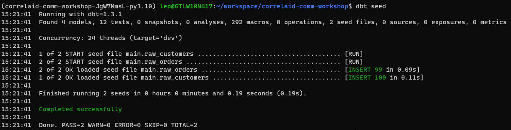
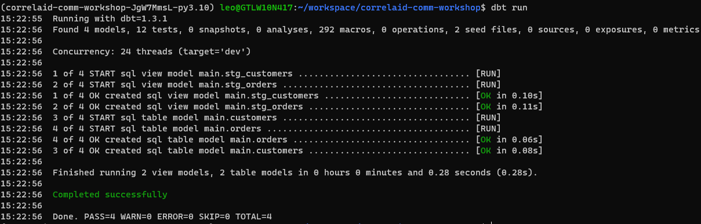
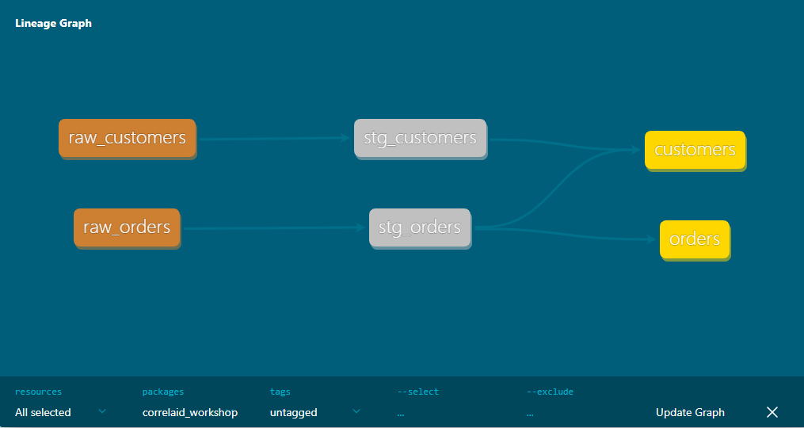
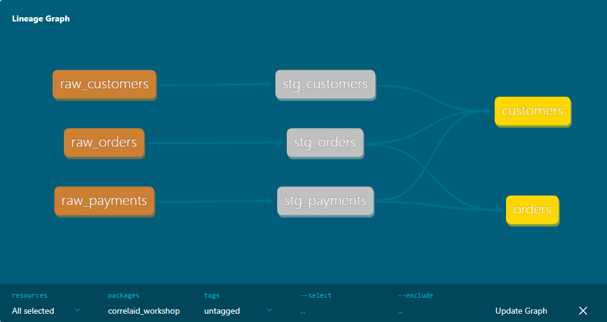

# Data engineering: Introduction to dbt


## Motivation
When working with relational databases for data engineering, one of the main tasks is data modeling:
- What data objects do we need?
- What are the relationships between the different objects?
- What grade of normalization do we need?
- ...

By answering these questions, we come up with a data model, that we then put into place by using DDL (Data definition language).
Example:
```sql
CREATE TABLE customers (
    first_name VARCHAR(255),
    last_name VARCHAR(255)
);
```
If we want to change that table in a later step, we have to adjust the model with an update:
```sql
ALTER TABLE customers ADD COLUMN mail VARCHAR(255);
```
Following up: How do we put this into code control, like versioning? There are some solutions, but these are not streamlined at all.

### What if ...
... we had an easier way to come up with the models in the first place, being able to alter the models and also have a way to do code control?
This is what [*dbt*](www.getdbt.com) tries to solve.


## Introduction into *dbt* + *DuckDB*
*Disclaimer: Next to dbt Core, there is also dbt Cloud, which is a SaaS. In this workshop, we will solely talk about dbt Core, the free open source variant.*
### *dbt* Core
*dbt* Core is a command line tool that scans your working folder for SQL files. Each file makes up one model (i.e. SQL select queries). *dbt* handles turning all these models into objects in our database. Go [here](https://docs.getdbt.com/docs/introduction#the-power-of-dbt) to get a quick glance on all the features of *dbt*.

### Relational Database: [*DuckDB*](https://duckdb.org/)
For the purpose of this workshop, we will use *DuckDB*, a filebased relational database. It allows everyone in the room to have their own database locally on their computer and we configure *dbt* to work with this local database in the following steps.

## Let's get started
1) Clone this repository
2) Use a command line tool of your choice and cd to the project folder
3) Checkout the workshop branch by calling `git checkout correlaid-workshop`
4) Create a virtual environment for the project by using ...
### ... [Poetry](https://python-poetry.org/) or

To install Poetry simply run 
```bash
curl -sSL https://install.python-poetry.org | python3 -
```
or visit [Installation](https://python-poetry.org/docs/#installation) for more information.

In your project folder run `poetry install` to set up your virtual environment. 

You have 2 options to run anything within the virtual environment. Either spawn a shell by using `poetry shell`
or use `poetry run [command]` to run any command from within the virtual environment.

### ...venv
Create a virtual environment by calling
```bash
python -m venv venv
```
Activate said environment
```bash
source venv/bin/activate
```
and install all requirements
```bash
pip install -r requirements.txt
```

## Prepare our database
In the subfolder `seeds` you find 3 `.csv`-files, which will be the source data for our workshop.
*dbt* can use these `.csv`-files to fill your database with some source data (more about that later). For now, we will just run
```bash
dbt seed
```

Lets have a look into the data by calling the *DuckDB* CLI: `duckcli correlaid.duckdb`
```sql
select * from raw_customers;
select * from raw_orders;
select * from raw_payments;
```

## First steps with *dbt*
### Basic building blocks of a *dbt* project
- [Project file](https://docs.getdbt.com/reference/dbt_project.yml): `dbt_project.yml`

This file lets *dbt* know that this directory and it's subfolders are a *dbt* project. 
It contains some general configurations for the project.
- [Profile](https://docs.getdbt.com/reference/profiles.yml): `profiles.yml`

This file defines the database connection. It can either be sitting in `~/.dbt/profiles.yml` or in the project folder itself.
- [Models](https://docs.getdbt.com/docs/build/sql-models): `models/some_random_model.sql`

The subfolder `models` (and it's subfolders) contain the models, that we define in our *dbt* project.
All `SQL`-files will be picked up by *dbt* and materialized into the database.
- [Model configs](https://docs.getdbt.com/reference/model-configs): `models/schema.yml`

We can configure our models in 3 different places: `dbt_project.yml`, a `.yml`-file within the model's folder, or a config block on top of our model.
The configuration will be evaluated in that order, which means that we can override generic configurations that are set in `dbt_project.yml` in the configuration block on top of the model file. 

*Best Practice*: place a `.yml` file in each subfolder under `models` and define the configs for that subfolder right there. Only make specific changes in the configuration block of a single model.

### A *dbt* model
Let's have a look into our first *dbt* model: `./models/staging/stg_customers.sql`. The purpose of this model: pick up the source table `raw_customers` and rename columns, recast values and reconsider the format, so that we have a consistent format for all of our source tables.

```sql
with source as (
    select * from {{ ref('raw_customers') }}
),
renamed as (
    select
        id as customer_id,
        first_name,
        last_name

    from source
)
select * from renamed
```
Within *dbt* models, we use a lot of CTEs (Common Table Expressions). These start with the `with [name] as`-clause and are essentially temporary tables that are only valid within the context of this model.

We can chain multiple queries as CTEs by combining them with a `,`. In each following CTE, we have access to all temporary tables that were defined beforehand.

The last query of the expression will be the result of the model and will be materialized to the database.

Let's have a look into the first part of the CTE:
```sql
with source as (
    select * from {{ ref('raw_customers') }}
),
```
Apart from raw `SQL`, we can also use `jinja` within our models. [`jinja`](https://docs.getdbt.com/docs/build/jinja-macros) is a lightweight templating language that will help us to have better control over our models.
In this case, we use the `{{ ref() }}`-function to reference other models that are defined within our *dbt* project. *dbt* uses this to know about the lineage and dependencies of our models.

In other cases, we could use jinja to introduce control structures like `if` and `for` to our models. More about that [here](https://docs.getdbt.com/reference/dbt-jinja-functions).

With this codeblock we have access to our raw customer data and it is wrapped in the temporary table `source`.
```sql
renamed as (
    select
        id as customer_id,
        first_name,
        last_name

    from source
)
```
For the next part, we pick up that raw data and rename the columns to our own liking.
```sql
select * from renamed
```
This last part selects from `renamed` to materialize the renamed table to our database.

The other model in our staging folder `./models/staging/raw_orders.sql` has the same structure. It transforms the raw orders into a table to our own liking.

Then there are also the 2 models in `./models/mart/`. These are more elaborated models that could be used for a dashboard or whatever. Please have a look on your own and try to understand those models.

### Materialize our models
One of the main commands of *dbt* is `dbt run`. It scans for the models that are already defined and materializes those models into the database. Let's try it and have another look into the database afterwards.
In your CLI, use
```bash
dbt run
```
`dbt run` picks up all the defined models, compiles them to valid `SQL` code and runs it against your database. 

Follow this up with
```bash
duckcli correlaid.duckdb
```
Compare your newly build models 
```sql
select * from stg_customers limit 10;
select * from stg_orders limit 10;
select * from customers limit 10;
select * from orders limit 10;
```

## Documentation
*dbt* has the ability to directly generate a documentation from your models.
To generate and view the documentation, simply call
```bash
dbt docs generate
dbt docs serve
```
Either a browser window will open up by itself or you could open [http://localhost:8080]
### The DAG (Directed Acyclic Graph)
By using the `{{ ref() }}` macro, you are building dependencies into your models. *dbt* uses these dependencies to build a DAG. This also works as a lineage graph for your models and data.

To view the DAG of your project, click the blue button in the bottom right corner of the documentation window.


### Descriptions of your models columns
We can use the left panel to navigate through our models. Each model is included with different metadata, including a description, columns, references, dependencies and the code itself.

*dbt* is using the `.yml` files in your project to put descriptions for tables and columns into place.
Let's have a look into `./models/mart/schema.yml`:
```yml
version: 2

models:
  - name: customers
    description: This table has basic information about a customer, as well as some derived facts based on a customer's orders

    columns:
      - name: customer_id
        description: This is a unique identifier for a customer
        tests:
          - unique
          - not_null

      - name: first_name
        description: Customer's first name. PII.
```
As you can see in line 5, we can add a `description` to each of our models. *dbt* will pick up this description and put it in the corresponding place in our documentation.

Additionally, as you can see in lines 9 & 15, we can also add the `description` tag for individual columns.
There is more stuff around the documentation, which you can read up [here](https://docs.getdbt.com/docs/collaborate/documentation)

## Build your own *dbt* model
Finally, there are some tasks for you to solve. Try to do your best with the knowledge that you just got. If you feel stuck, either ask me or have a look into the main branch.

1) rename `./seeds/raw_payments.csv_ignore` to `./seeds/raw_payments.csv`. Afterwards run `dbt seed` to seed this file into your database.
2) introduce a staging model for payments that picks up the data from `raw_payments` and renames the columns to your liking.
3) within `stg_payments`, convert the amount from cents to euros. Make sure to document this correctly in the corresponding `.yml`-file.
4) add payments to your `mart/orders` model. Combine all the payments for one order in one row and have one column for each of the different payment methods. Also add the total amount. 
It should look something like this:

| order_id | customer_id | order_date | status   | credit_card_amount | coupon_amount | bank_transfer_amount | gift_card_amount | total_amount |
| -------- | ----------- | ---------- | -------- | ------------------ | ------------- | -------------------- | ---------------- | ------------ |
| 1        | 1           | 2018-01-01 | returned       | 10                 | 0             | 0                    | 0                | 10     |
| 2        | 3           | 2018-01-02 | completed      | 20                 | 0             | 0                    | 0                | 20     |
| 3        | 94          | 2018-01-04 | completed      | 0                  | 1             | 0                    | 0                | 1      |
| 4        | 50          | 2018-01-05 | completed      | 0                  | 25            | 0                    | 0                | 25     |
| 5        | 64          | 2018-01-05 | completed      | 0                  | 0             | 17                   | 0                | 17     |
| 6        | 54          | 2018-01-07 | completed      | 6                  | 0             | 0                    | 0                | 6      |
| 7        | 88          | 2018-01-09 | completed      | 16                 | 0             | 0                    | 0                | 16     |
| 8        | 2           | 2018-01-11 | returned       | 23                 | 0             | 0                    | 0                | 23     |
| 9        | 53          | 2018-01-12 | completed      | 0                  | 0             | 0                    | 23               | 23     |
| 10       | 7           | 2018-01-14 | completed      | 0                  | 0             | 26                   | 0                | 26     |

1) add payments to your `mart/customers` model. For this, sum up all orders belonging to each customer and add a column like `customer_lifetime_value`. Make sure to only include orders that were not returned. It should look like this:

| customer_id | first_name | last_name | first_order | most_recent_order | number_of_orders | customer_lifetime_value |
|-------------|------------|-----------|-------------|-------------------|------------------|-------------------------|
| 1           | Michael    | P.        | 2018-01-01  | 2018-02-10        | 2                | 33                      |
| 2           | Shawn      | M.        | 2018-01-11  | 2018-01-11        | 1                | 23                      |
| 3           | Kathleen   | P.        | 2018-01-02  | 2018-03-11        | 3                | 65                      |
| 6           | Sarah      | R.        | 2018-02-19  | 2018-02-19        | 1                | 8                       |
| 7           | Martin     | M.        | 2018-01-14  | 2018-01-14        | 1                | 26                      |
| 8           | Frank      | R.        | 2018-01-29  | 2018-03-12        | 2                | 45                      |
| 9           | Jennifer   | F.        | 2018-03-17  | 2018-03-17        | 1                | 30                      |
| 11          | Fred       | S.        | 2018-03-23  | 2018-03-23        | 1                | 3                       |
| 12          | Amy        | D.        | 2018-03-03  | 2018-03-03        | 1                | 4                       |
| 13          | Kathleen   | M.        | 2018-03-07  | 2018-03-07        | 1                | 26                      |

5) add descriptions for the newly added columns.
6) rebuild the docs and have a look into the lineage graph and your added column descriptions.


## Whats next
- The [*dbt* Fundamentals Course](https://courses.getdbt.com/collections) is a free course which takes about 3.5h to 5h and gives a great overview the different features in *dbt*. There are more features, that we have not touched today.
- The [*dbt* Docs](https://docs.getdbt.com/) is a great resource for all kind of knowledge around *dbt*.
- Feel free to contact me anytime about any questions regarding *dbt*.